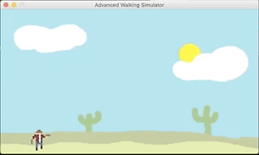

# pygame-cowboy

Simple 2d game to get familiar with pygame and object-oriented in python.

## Requirements

You need to have ``pygame`` installed:

    pip install -r requirements.txt

## Run

You can start the game with the following command:

    python ./game.py

## Todo

- [ ] Add more enemy sprites
- [x] Class `Entity` for shared code of enemy & player
- [ ] background scrolling